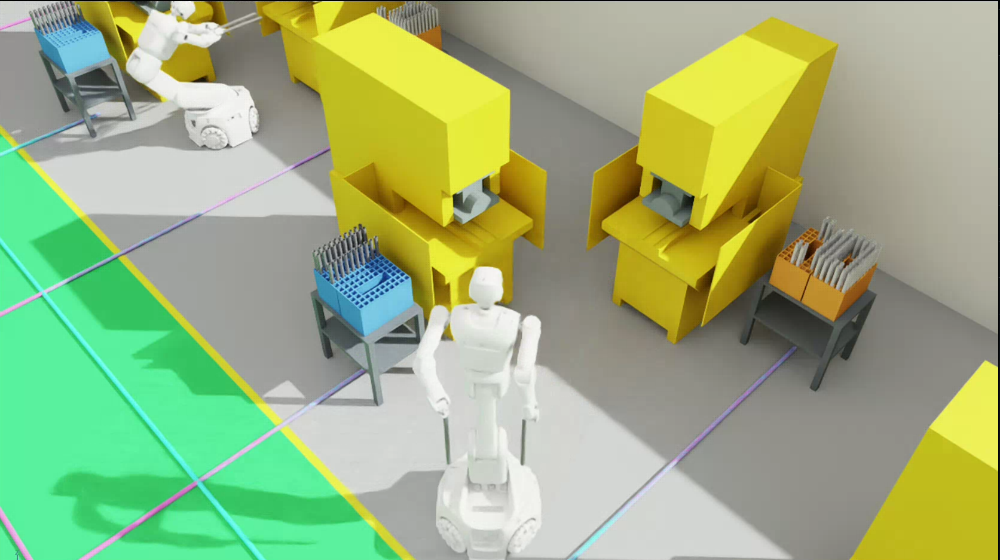

# 人形机器人上下料与 AGV 流水线仿真

本项目基于 Isaac Sim 搭建人形机器人冲床上下料工厂，包含工厂场景、L 形双机加工单元、双臂连续上下料、两道冲压工序、料箱孔位管理，以及 HIK-Q2-400D 潜伏式 AGV 的跨 cell 物流调度。

当前完整演示由 12 个加工 cell、24 台冲床、12 台人形机器人和 8 台 AGV 组成。机器人每次左右手各搬运一根铝管；AGV 负责空箱复用、半成品转运、原料补给和最终成品入库。

<p align="center">
  
</p>

## 主要功能

- 使用现有 URDF、STL 和 USD 资源还原完整工厂
- 24 台机床组成 12 个 L 形 cell：靠墙机床为工序1，靠走廊机床为工序2。
- 每个 cell 由一台 夸父5-w 人形机器人服务两台机床。
- 每个料箱架放置两个料箱，每个 cell 共两个料箱架、四个料箱。
- 原料箱采用 `10 × 6` 孔阵列，仅使用外侧两圈，共 48 个有效孔位。
- 机器人一次取两根铝管，依次完成机床1加工、机床2加工，并放入成品箱对应孔位。
- 加工后的铝管不会消失；两个原料箱加工完后为空，两个成品箱对应装满 96 根铝管。
- 冲头在上料前抬升，放料后下压，再抬升供机器人取出工件。
- 机器人从原料箱离开时采用“后退—横移—原地转向”的分段路径，避免右臂斜向扫过机床。
- 四条流水线同时调度，每条流水线包含 3 个 cell 和 2 台 AGV。
- AGV 按差速底盘运动：只能直行、倒车和原地转向，不使用横移。
- AGV 支持双车道、V2V 路权预约、等待和换道避障，并在中央竖向通道停车。
- 机床外壳采用醒目的工业黄色，冲头和模具保留独立材质及状态变化。

## 工厂布局

| 项目 | 当前配置 |
| --- | --- |
| 房间尺寸 | `18.5 m × 29.0 m` |
| 纵向走廊 | 2 条，宽 `2.5 m` |
| 横向走廊 | 宽 `2.5 m`，仅连接两条纵向走廊 |
| 加工 cell | 12 个，东西两侧各 6 个 |
| 机床 | 24 台，每个 cell 2 台 |
| 人形机器人 | 12 台，每个 cell 1 台 |
| cell 侧料箱架 | 24 个 |
| cell 侧料箱 | 48 个 |
| 有效原料孔位 | 每箱 48 个 |
| 基础场景铝管 | 1152 根 |
| 生产线 | 4 条，每条 3 个 cell |
| AGV | 8 台，每条生产线 2 台 |

机床工作区使用平整的灰色地面，两条纵向走廊和中间横向走廊为绿色，走廊边缘使用黄色细线标记。两条纵向走廊之间为原料区和成品区，不再布置机床。

每个 L 形 cell 的布置规则如下：

- 机床1靠墙并正对走廊，负责第一道冲压工序。
- 机床2靠近走廊并与走廊平行，负责第二道冲压工序。
- 两台机床的中轴线在机器人的操作点相交。
- 原料料箱架位于机床1侧，成品料箱架位于机床2靠走廊侧。
- 东西两侧 cell 的料箱架和机器人动作互为镜像。

## 加工流程

单个 cell 的连续加工过程为：

1. 左右手分别从原料箱的两个孔位插入并取出一根铝管。
2. 保持双管竖直，机器人先退出料箱，再沿机床前方横移并原地转向。
3. 机床1冲头抬升，机器人将两根铝管插入左右夹具。
4. 机器人退出，机床1下压加工并重新抬升。
5. 机器人取出半成品，转移到机床2的左右夹具。
6. 机床2完成第二次冲压。
7. 机器人先恢复竖直携管姿态，离开机床后再移动到成品箱。
8. 两根成品放入与原料孔位对应的成品孔位。
9. 返回原料箱处理下一组，直到两个原料箱全部清空。

动作由 URDF 正向/逆向运动学求解，并通过碰撞规避关键帧平滑插值。机器人底盘 Z 坐标始终固定为 `0`，不会在运动过程中跳起。

## AGV 流水线逻辑

每条流水线按 `Cell1 → Cell2 → Cell3` 组织，两个 AGV 通过任务依赖和动态规划分配七个搬运任务：

1. Cell3 成品运往中央成品区；Cell3 的空原料箱架转为其成品箱架。
2. Cell2 成品运至 Cell3 原料位；Cell2 的空原料箱架转为其成品箱架。
3. Cell1 成品运至 Cell2 原料位；Cell1 的空原料箱架转为其成品箱架。
4. 中央原料区的满载箱架补充到 Cell1 原料位。

空料箱不会运出工厂，而是继续作为成品料箱使用。机器人只有在新的满载原料架放下、AGV 顶升机构收回并离开工位后才开始加工。

AGV 演示还包含以下约束：

- 两台 AGV 初始发车时间错开 `4 s`，但可并行执行任务。
- 每条纵向走廊划分左右两条车道，中心偏移为 `0.55 m`。
- AGV 原地转向后再进入下一条直线路段，搬运过程中不斜行。
- 顶升平台行程为 `60 mm`，AGV 短边进入料箱座长边开口。
- 路径发生占用冲突时，通过 V2V 预约让其中一台等待或切换车道。
- 调度结束后，AGV 停在连接横向走廊的中央竖向通道，不堵塞走廊入口

完整 AGV 演示的初始状态是：cell 原料箱为空、成品箱为满载，中央原料区存放满载箱架。物流完成新的原料补给后，对应机器人开始连续加工。

## 项目结构

```text
.
├── assets/
│   ├── materials/aluminum_tube.usd # 铝管共享资产
│   └── robots/biped_s62/           # 人形机器人 USD 资产
├── biped_s62/
│   ├── urdf/                        # 人形机器人 URDF
│   ├── meshes/                      # 人形机器人网格
│   └── 工厂场景/                    # 机床、AGV、料箱、料箱座和铝管源文件
├── scenes/                          # 运行生成脚本后创建
├── scripts/
│   ├── create_factory_scene.py      # 生成工厂基础场景
│   ├── open_factory_scene.py        # 仅打开基础场景
│   ├── inspect_single_robot_loading.py
│   ├── single_robot_loading_kinematics.py
│   ├── preview_single_robot_loading.py
│   ├── preview_all_cells_loading.py
│   └── preview_agv_pipeline_demo.py # 完整 AGV 流水线演示
├── requirements.txt
└── run.sh                           # 可移植的完整演示入口
```

## 环境要求

- Ubuntu Linux
- NVIDIA GPU 和可用的图形驱动
- Isaac Sim / Isaac Lab Python 环境
- Python 依赖：`numpy`、`scipy`

将 `ISAAC_PYTHON` 指向本机 Isaac Sim/Isaac Lab 的 Python 解释器。例如：

```bash
export ISAAC_PYTHON=/path/to/isaac-sim/python.sh
```

如果已经激活包含 Isaac Sim 的 Conda 环境，也可以使用：

```bash
export ISAAC_PYTHON=python
```

## 快速开始

所有命令都应先进入项目根目录并设置 Isaac Python：

```bash
cd humanoid-loading-factory-sim
export ISAAC_PYTHON=/path/to/isaac-sim/python.sh
```

### 1. 重新生成基础场景

```bash
"${ISAAC_PYTHON}" scripts/create_factory_scene.py --headless
```

生成文件：`scenes/humanoid_loading_factory.usd`

如只需快速检查布局，可使用方盒机床代理：

```bash
"${ISAAC_PYTHON}" scripts/create_factory_scene.py --headless --proxy-machines
```

### 2. 仅打开工厂场景

```bash
"${ISAAC_PYTHON}" scripts/open_factory_scene.py
```

### 3. 单机器人动作调试

```bash
"${ISAAC_PYTHON}" scripts/preview_single_robot_loading.py
```

只运行一套双管流程并停在最终状态：

```bash
"${ISAAC_PYTHON}" scripts/preview_single_robot_loading.py --once
```

### 4. 12 个 cell 同时连续加工

```bash
"${ISAAC_PYTHON}" scripts/preview_all_cells_loading.py
```

### 5. 完整 AGV 流水线演示

```bash
"${ISAAC_PYTHON}" scripts/preview_agv_pipeline_demo.py
```

也可以使用项目中的本机快捷命令：

```bash
ISAAC_PYTHON="${ISAAC_PYTHON}" ./run.sh
```

## 无界面检查

以下命令用于检查关键帧、全部 cell 和 AGV 调度，不长期打开图形窗口：

```bash
"${ISAAC_PYTHON}" scripts/preview_single_robot_loading.py --headless --check
"${ISAAC_PYTHON}" scripts/preview_all_cells_loading.py --headless --check
"${ISAAC_PYTHON}" scripts/preview_agv_pipeline_demo.py --headless --check
```

成功时可看到类似输出：

```text
CHECK PASSED: all continuous-cycle keyframes applied
CHECK PASSED: all 12 cells and all 48 cycles
CHECK PASSED: AGV DP schedule, rack transport, and robot triggers
```

## 实现说明与边界

- 人形机器人使用确定性的 FK/IK 和关键帧插值进行运动学演示，不是强化学习策略或动力学控制器。
- 为避免地面接触冲量干扰预览，动作脚本运行时会关闭机器人碰撞形状；当前避碰依赖人工设计的安全关键帧和视觉检查。
- AGV 使用真实 STL 外观和差速底盘运动约束，但路径、顶升和料箱搬运仍是运动学可视化，不是轮速闭环控制。
- AGV 避障采用预先计算的占用矩形、V2V 路权预约、等待和换道策略，不是在线激光雷达导航。
- 场景 USD 引用了本项目内的机器人和材料资产。移动项目目录后建议重新运行场景生成脚本。

## 常见问题

### 提示 `can't open file '.../scripts/...'`

说明当前目录不在项目根目录。先执行：

```bash
cd humanoid-loading-factory-sim
```

再运行 `scripts/...` 命令。

### 完整演示启动较慢

完整演示会在创建 Isaac Sim 窗口前求解两个料箱的 48 套双臂动作，因此终端可能数分钟没有输出。等待出现 Isaac Sim 扩展加载信息即可，不要重复启动多个实例。

### 需要重新启动可视化

先关闭旧进程，再重新运行：

```bash
pkill -f preview_agv_pipeline_demo.py
"${ISAAC_PYTHON}" scripts/preview_agv_pipeline_demo.py
```

### 出现机器人末端 `Unresolved reference prim path` 警告

当前机器人 USD 中部分末端视觉引用会产生警告。只要场景继续加载、机器人主体可见且演示开始，这些警告不会阻止现有运动学演示。
